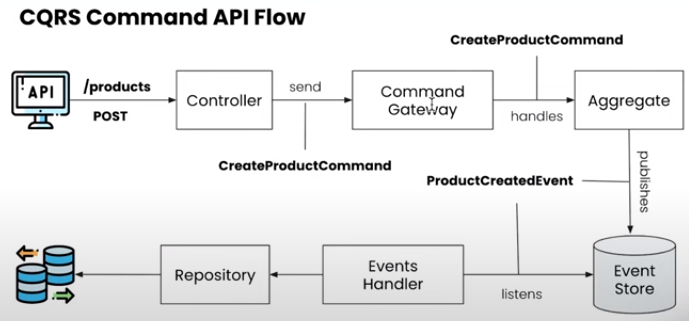

# implement-CQRS-design-pattern-and-Event-Sourcing-with-Spring-Boot

## Introduction
cqrs-es-spring-boot is a sample project that implements CQRS design pattern and Event Sourcing with Spring Boot.

## Command Query Responsibility Segregation (CQRS)
CQRS stands for Command Query Responsibility Segregation. It is a pattern that separates read and write operations for a data store. It is a pattern that is used to separate the read and write models for a data store. The read model is optimized for querying data, the write model is optimized for inserting, updating, and deleting data.

## Event Sourcing
Event Sourcing is a pattern that stores all changes to an application state as a sequence of events. It is a pattern that is used to store all changes to an application state as a sequence of events. The sequence of events is stored in an event store. The current state of the application is derived by replaying these events.

## CQRS command API FLOW

